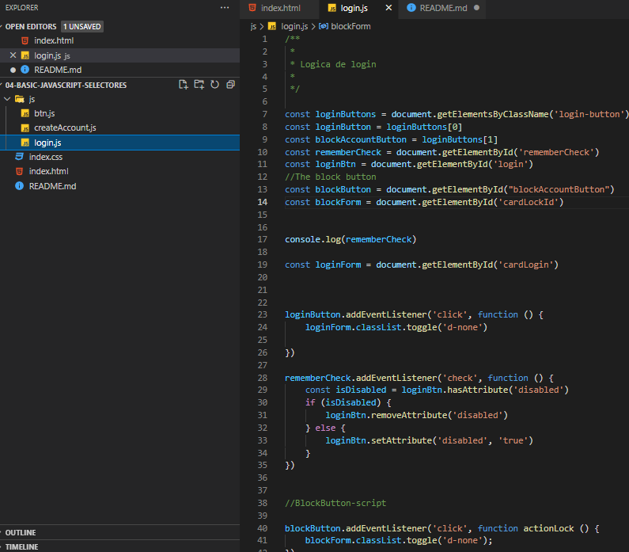

## Actividad
>Ejercicio de formulario

         HTML|Boostrap Template|Javascritpt


>Example code login.js
### Se le agrego un boton de Bloqueo de Usuario Linea 13-14-40
```javascript
/**
 *
 * Logica de login
 *  
 */

const loginButtons = document.getElementsByClassName('login-button') // Retorna un array con todos los elementos encontrados con la clase solicitada
const loginButton = loginButtons[0]
const blockAccountButton = loginButtons[1]
const rememberCheck = document.getElementById('rememberCheck')
const loginBtn = document.getElementById('login')
//The block button
const blockButton = document.getElementById("blockAccountButton")
const blockForm = document.getElementById('cardLockId')


console.log(rememberCheck)

const loginForm = document.getElementById('cardLogin')


loginButton.addEventListener('click', function () {
    loginForm.classList.toggle('d-none')

})

rememberCheck.addEventListener('check', function () {
    const isDisabled = loginBtn.hasAttribute('disabled')
    if (isDisabled) {
        loginBtn.removeAttribute('disabled')
    } else {
        loginBtn.setAttribute('disabled', 'true')
    }
}) 
 

//BlockButton-script

blockButton.addEventListener('click', function actionLock () {
    blockForm.classList.toggle('d-none');
})
//Function Point
// const actionPoint = function (){
//     if(actionPoint){
//         blockButton.addEventListener('click', function () {
//             blockForm.classList.toggle('d-none');
//         })
//     }else{
//         null;
//     }
// }


```